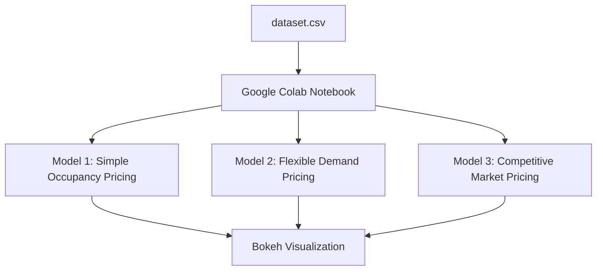

# Capstone_project
# Smart Parking Price Management in Urban Areas

## Project Overview

Urban parking has become a major issue due to the increasing number of vehicles and limited available spaces. This project introduces a smart pricing solution that helps manage parking more effectively by using dynamic pricing strategies. The system is built to simulate real-time pricing changes using historical parking data and to visualize these price updates in an easy-to-understand format using Bokeh within Google Colab.

This project is simple to execute, practical for learning, and demonstrates a scalable approach to handling parking congestion in city areas.

---

## Tools and Technologies Used

The following tools were used to build the project in a simple and efficient way:

* **Python:** Main language used for building and simulating the system.
* **Pandas:** Used for reading, processing, and cleaning the parking data.
* **Numpy:** Helps with the calculations needed to adjust parking prices.
* **Bokeh:** Used to create interactive graphs for visualizing the pricing changes clearly over time.

---

## Project Steps

The project follows an easy and organized structure:

* **Step 1:** Import the parking lot dataset into Google Colab.

* **Step 2:** Process the data in smaller batches to simulate streaming, helping to create a real-time effect without the need for a server setup.

* **Step 3:** Apply three pricing models to determine the parking rates for each parking lot:

  1. **Simple Occupancy Model:** Prices go up as the parking lot gets more full. This helps control the demand.
  2. **Flexible Demand Model:** This model changes prices based on many factors like the number of cars waiting, traffic nearby, vehicle type, and special event days.
  3. **Competitive Market Model:** This model also considers simulated competitor prices to keep the parking rates attractive and realistic.

* **Step 4:** Display the pricing results using Bokeh visualizations so that users can see how prices vary across different parking lots and models.

---

## Visual Flow of the System

---

## Files Included in the Project

* `Dynamic_Pricing_RealTime.ipynb`: Google Colab notebook containing the batch simulation and Bokeh visualizations.
* `dataset.csv`: The main parking lot dataset used for this simulation, including parking usage, queue lengths, and traffic conditions.
* `README.md`: This file, providing a detailed explanation of the project design and working process.
* `problem_statement.pdf`: The original problem description provided for this project.

---

## Final Result

The project successfully shows how parking prices can be adjusted dynamically using easy-to-understand models and batch-based simulation. The final Bokeh plots allow us to see pricing patterns clearly and compare the effects of each pricing strategy.

The project is fully designed to work inside Google Colab, making it accessible, fast, and easy to run without any need for complex system setups.
